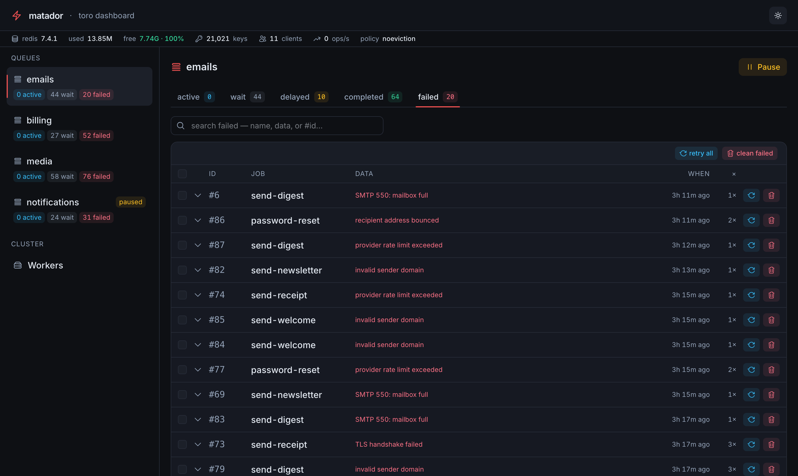

# matador 🗡️

A live, **server-rendered** dashboard for [toro](https://github.com/ilovepixelart/toro)
queues — watch queues, inspect jobs, and act on them (retry, remove, promote,
pause…) from the browser.



```bash
pip install matador-dashboard   # the import name is `matador`
```

> Installed as **`matador-dashboard`** on PyPI (the name `matador` was taken), but
> you `import matador`.

## What it is

FastAPI + Jinja on the server, **HTMX + Tailwind** on the page — no SPA, no build
step to run. Every queue / tab / page is a real URL, so reload, back/forward and
deep-links all work. It reads straight from Redis through toro's async API.

## Features

- **Queues sidebar** with per-state counts, and **state tabs** (active / waiting /
  delayed / completed / failed) that swap the job list over HTMX.
- **Job detail** lazy-loaded on expand: data, options, return value, timings,
  logs, and stack traces — syntax-highlighted server-side (Pygments, no client JS).
- **Search** within a state by job id or a name/data substring.
- **Live updates** over SSE — counts refresh as jobs complete, no reload.
- **Actions**: pause/resume a queue, retry/remove/promote a job, retry-all,
  clean a state, and schedulers (run-now / remove) — each behind a styled confirm
  dialog (not `window.confirm`).
- **Numbered pagination**, a **Redis health bar** (memory, clients, eviction
  policy), and a persistent **dark / light** theme.

## Run it

```bash
uv run python scripts/seed.py             # optional: populate demo data
uv run uvicorn scripts.run:app --reload   # http://localhost:8000
```

`scripts/run.py` watches a few demo queues; edit the list there, or wire it up yourself.

## Integrate into an existing app

matador is an ASGI app — `mount` it into your FastAPI/Starlette service at any path.
URLs are `root_path`-aware (Starlette `url_for`), so a sub-path mount just works.

```python
from fastapi import Depends
from matador import create_app

app.mount(
    "/admin/queues",
    create_app(
        ["emails", "billing"],
        connection=redis,                       # share your existing redis pool
        dependencies=[Depends(require_admin)],  # protect it with your auth
    ),
)
```

- **Mount anywhere** — links, static assets and the SSE stream all carry the mount
  prefix automatically; works behind a path-stripping reverse proxy too.
- **`connection=`** — pass your `redis.asyncio.Redis` so matador shares your pool
  (it never closes a connection it didn't open). Omit it to open its own from `url=`.
  This is also the right way to embed: a mounted sub-app's lifespan doesn't run, so
  the host should own the connection.
- **`dependencies=`** — applied to every route, so your app's auth gates the
  dashboard. (The `/static` mount isn't covered — wrap the whole mount if the assets
  themselves need auth.)
- Other stacks (Django, Flask, non-Python): run matador standalone and reverse-proxy.

Standalone is just the no-extras case:

```python
app = create_app(["emails", "billing"], url="redis://localhost:6379")
```

It serves **HTML** (an HTMX UI), not a JSON API — point a browser at it.

## Develop

Managed with [uv](https://astral.sh/uv); the Astral toolchain throughout.

```bash
uv sync                          # venv + deps + dev group
uv run ruff check . && uv run ruff format .   # lint (strict) + format
uv run ty check                  # type check
uv run pytest                    # unit + integration (needs Redis on :6379)
uv run pytest -m e2e             # Playwright browser tests (run separately)

# rebuild the stylesheet while editing templates/styles
./tailwindcss -i styles/input.css -o matador/static/app.css --watch
```

## License

[MIT](./LICENSE)
